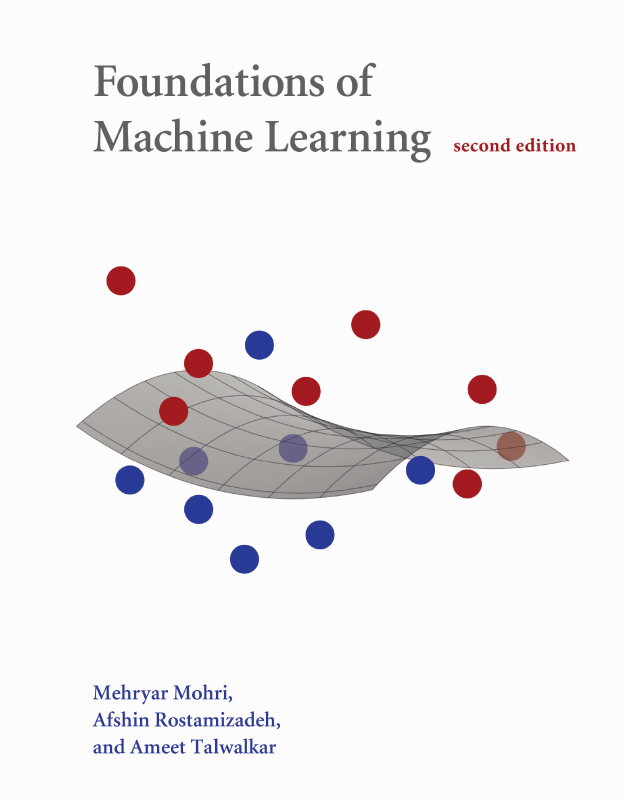
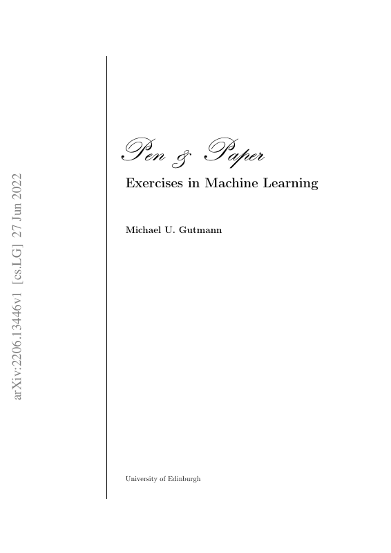
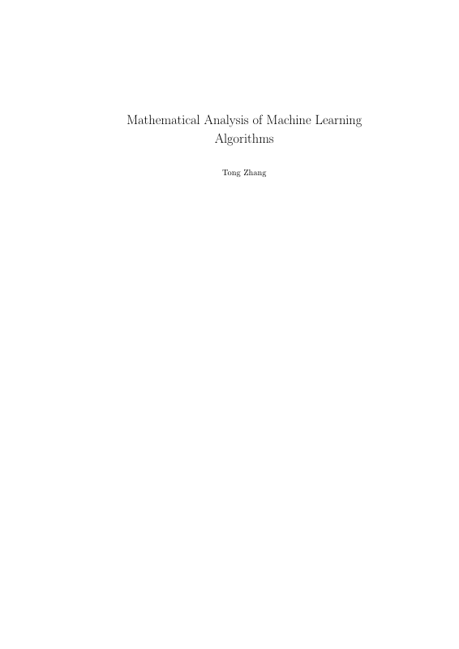
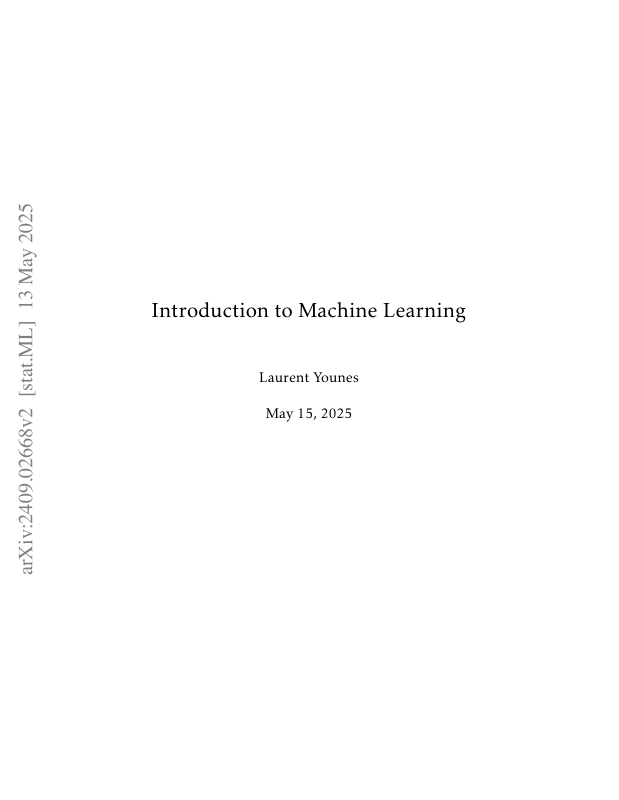
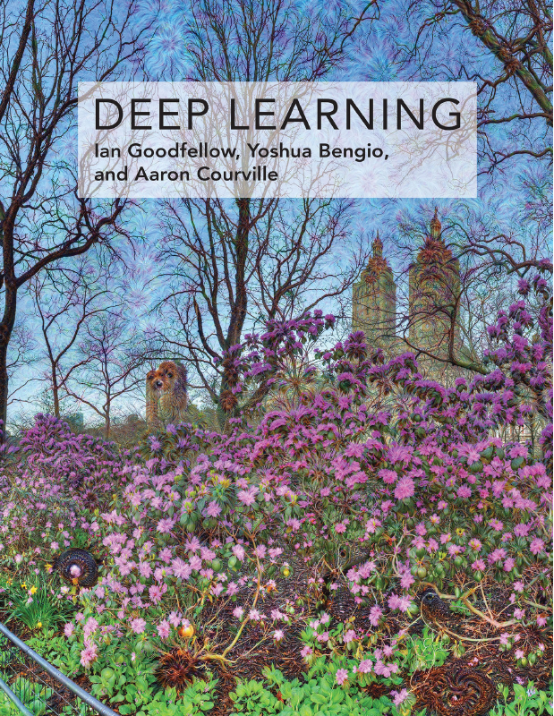
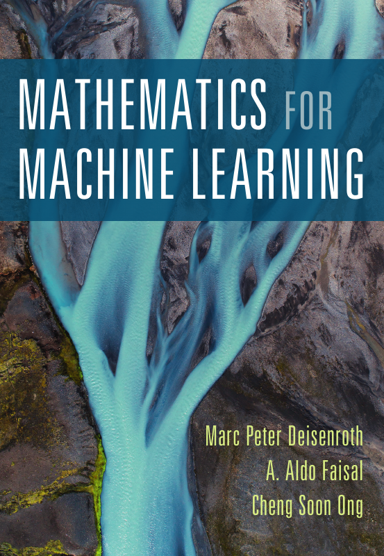
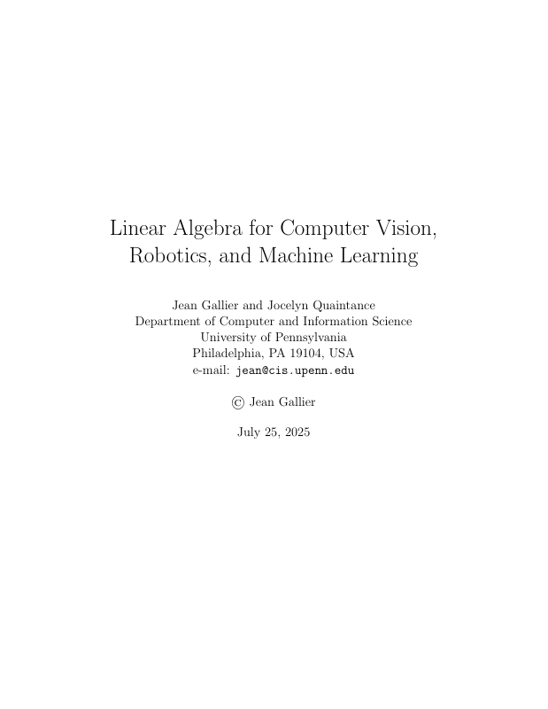

# ML Books

A curated collection of freely available machine learning books.

## Books

### Machine Learning

<table>
  <tr>
    <td width="120" align="center"></td>
    <td>
      <strong><a href="books/machine-learning/ml_001.pdf">Foundations of Machine Learning, 2nd Ed.</a></strong> 
      Mehryar Mohri, Afshin Rostamizadeh, Ameet Talwalkar (2018) 
      CC BY-NC-ND
    </td>
  </tr>
  <tr>
    <td width="120" align="center"></td>
    <td>
      <strong><a href="books/machine-learning/ml_002.pdf">Pen & Paper Exercises in Machine Learning</a></strong> 
      Michael U. Gutmann (2022) 
      CC BY 4.0
    </td>
  </tr>
  <tr>
    <td width="120" align="center"></td>
    <td>
      <strong><a href="books/machine-learning/ml_003.pdf">Mathematical Analysis of Machine Learning Algorithms</a></strong> 
      Tong Zhang (2023) 
      Free for personal use
    </td>
  </tr>
  <tr>
    <td width="120" align="center"></td>
    <td>
      <strong><a href="books/machine-learning/ml_004.pdf">Introduction to Machine Learning</a></strong> 
      Laurent Younes (2025) 
      Free online (arXiv)
    </td>
  </tr>
</table>

### Deep Learning

<table>
  <tr>
    <td width="120" align="center"></td>
    <td>
      <strong><a href="books/deep-learning/dl_001.pdf">Deep Learning</a></strong> 
      Ian Goodfellow, Yoshua Bengio, Aaron Courville (2017) 
      Free online
    </td>
  </tr>
</table>

### Math

<table>
  <tr>
    <td width="120" align="center"></td>
    <td>
      <strong><a href="books/math/math_001.pdf">Mathematics for Machine Learning</a></strong> 
      Marc Peter Deisenroth, A. Aldo Faisal, Cheng Soon Ong (2020) 
      Free for personal use
    </td>
  </tr>
  <tr>
    <td width="120" align="center"></td>
    <td>
      <strong><a href="books/math/math_002.pdf">Linear Algebra for CV, Robotics, and ML</a></strong> 
      Jean Gallier, Jocelyn Quaintance (2025) 
      Free online
    </td>
  </tr>
</table>
